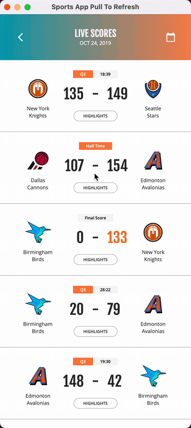
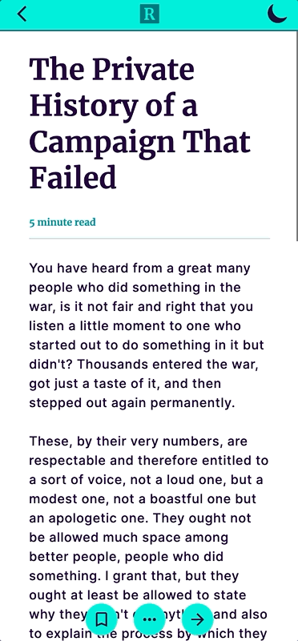
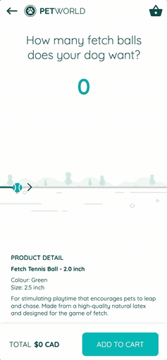
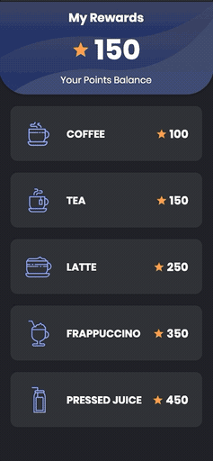
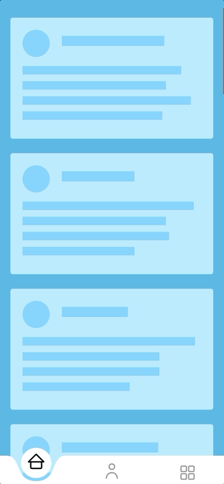
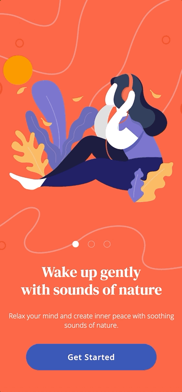
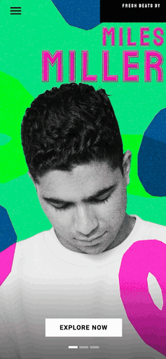
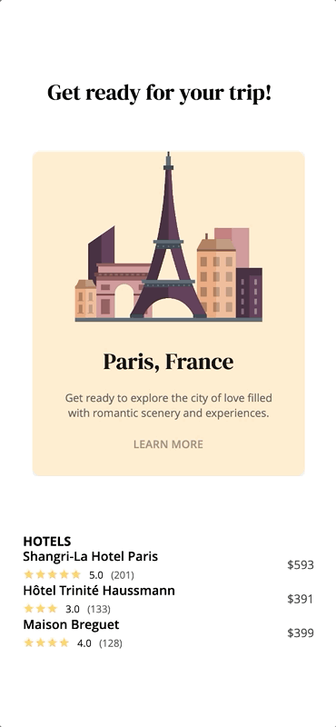
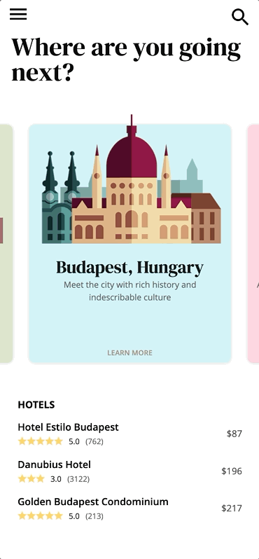
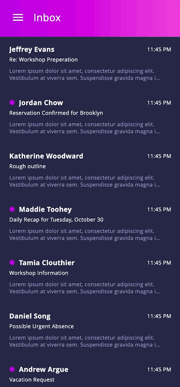

# Avalonia Vignettes

Avalonia ports of [gskinner's Flutter Vignettes](https://github.com/gskinnerTeam/flutter_vignettes), a collection of explorations into what a UI framework can be pushed to do.

Each port is written from the original Dart source, keeping its numbers and its easing curves, and expressing them with Avalonia idioms: custom controls where a control is warranted, resource dictionaries for brushes and metrics, control themes for templates, styles for typography.

## The vignettes

<a href="vignettes/basketball_ptr"></a>

### [Sports App Pull To Refresh](vignettes/basketball_ptr)

A custom pull to refresh: a basketball spins around the hoop while the scores reload.

<a href="vignettes/bubble_tab_bar"></a>

### [Icon Flip Button Bar](vignettes/bubble_tab_bar)

A navigation bar whose buttons change size, shape and colour as they are picked.

<a href="vignettes/constellations_list"></a>

### [Guide To the Stars Particles](vignettes/constellations_list)

A starfield drawn behind the whole app, flying faster as the list is scrolled and as a page opens.

<a href="vignettes/dark_ink_transition"></a>

### [Article Dark Mode](vignettes/dark_ink_transition)

Ink spreads across the article to carry it between the light and dark schemes, masked by a frame sequence.

<a href="vignettes/dog_slider"></a>

### [Dog Toy Slider](vignettes/dog_slider)

Drag the ball along the track and the dog gives chase, then folds into a sit once it arrives.

<a href="vignettes/drink_rewards_list"></a>

### [Liquid Rewards Cards](vignettes/drink_rewards_list)

Tap a card and it springs open, then fills with liquid that sloshes as it settles.

<a href="vignettes/fluid_nav_bar"></a>

### [Fluid Button Bar](vignettes/fluid_nav_bar)

The bar's top edge dips under whichever button is picked, and sloshes as that dip travels across.

<a href="vignettes/gooey_edge"></a>

### [Mindfulness Gooey Transition](vignettes/gooey_edge)

Swipe between pages and the incoming one is revealed through a liquid edge that follows the pointer.

<a href="vignettes/indie_3d"></a>

### [Feature Artist Carousel](vignettes/indie_3d)

Swipe between artists while a field of 3D shapes drifts behind and in front of them.

<a href="vignettes/parallax_travel_cards_hero"></a>

### [Paris Travel Hero Transition](vignettes/parallax_travel_cards_hero)

Tap the city card and it opens into a full scene, the road unrolling and the skyline assembling as it grows.

<a href="vignettes/parallax_travel_cards_list"></a>

### [Travel Cards](vignettes/parallax_travel_cards_list)

Drag through the cards and the three artwork layers slide past each other while the card tilts in 3D.

<a href="vignettes/particle_swipe"></a>

### [Inbox Swipe Particles](vignettes/particle_swipe)

Swipe a row left to delete it and it bursts into particles; swipe right to star it and the burst opens as a ring.

## Running

Needs the .NET 10 SDK. Each vignette is its own app:

```
dotnet run --project vignettes/basketball_ptr/BasketballPullToRefresh.csproj
```

[`vignettes/_shared`](vignettes/_shared) holds what they have in common: Flutter's animation controller, ticker and curves, a `PageView`, `Hero` flights, perspective transforms.

## Licence

MIT, and so are the originals. See [LICENSE](LICENSE).
