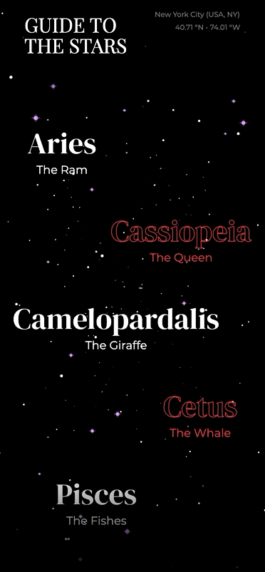

# Guide To the Stars Particles

An Avalonia port of [constellations_list](https://github.com/gskinnerTeam/flutter_vignettes/tree/master/vignettes/constellations_list).

<p align="center"></p>

A starfield drawn behind the whole app, flying faster as the list is scrolled and as a page opens.

## Running

```
dotnet run --project ConstellationsList.csproj
```
