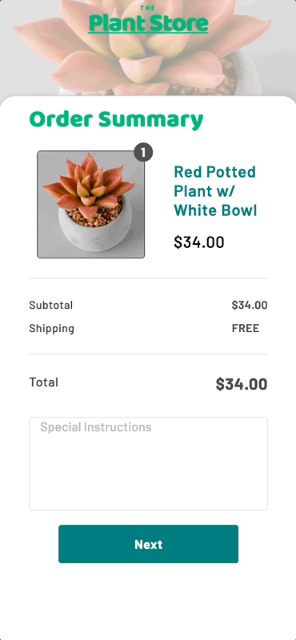

# Plant Shopping Cart

An Avalonia port of [plant_forms](https://github.com/gskinnerTeam/flutter_vignettes/tree/master/vignettes/plant_forms).

<p align="center"></p>

A checkout in three pages, each sliding up over the last. The submit button fills as the fields are validated, and the country picked decides which fields follow it.

## Running

```
dotnet run --project Desktop/PlantForms.Desktop.csproj
```
