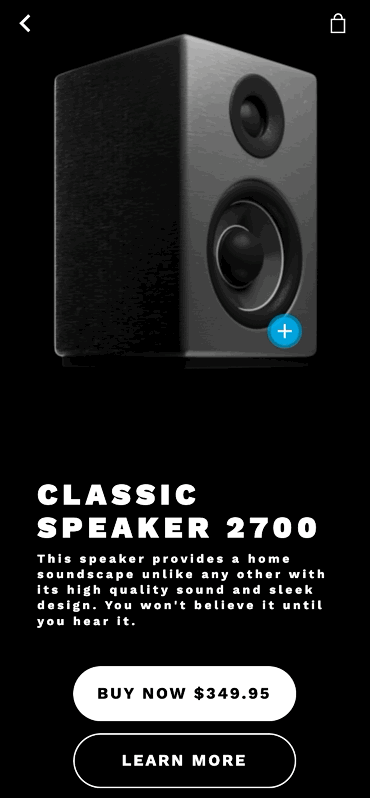

# Product Zoom Transition

An Avalonia port of [product_detail_zoom](https://github.com/gskinnerTeam/flutter_vignettes/tree/master/vignettes/product_detail_zoom).

<p align="center"></p>

Press the zoom and the speaker spins through a frame sequence while the screen goes black around it, then the callouts draw themselves in over the top.

## Running

```
dotnet run --project ProductDetailZoom.csproj
```
