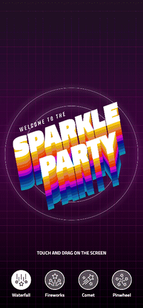

# Sparkle Party Particles

An Avalonia port of [sparkle_party](https://github.com/gskinnerTeam/flutter_vignettes/tree/master/vignettes/sparkle_party).

<p align="center"></p>

Twenty thousand particles in four presets: a comet that chases the pointer, fireworks, a pinwheel and a waterfall you can push aside.

## Running

```
dotnet run --project SparkleParty.Desktop/SparkleParty.Desktop.csproj
```

Every particle is drawn as two textured triangles and the whole field goes to Skia in one `drawVertices` call, the same as the original.
