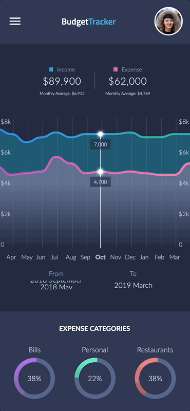

# BudgetTracker Graphs

An Avalonia port of [spending_tracker](https://github.com/gskinnerTeam/flutter_vignettes/tree/master/vignettes/spending_tracker).

<p align="center"></p>

Drag the chart to move through the months and it snaps to a whole one when let go. Tap to call out a month, and the totals roll over as the window moves.

## Running

```
dotnet run --project SpendingTracker.Desktop/SpendingTracker.Desktop.csproj
```
