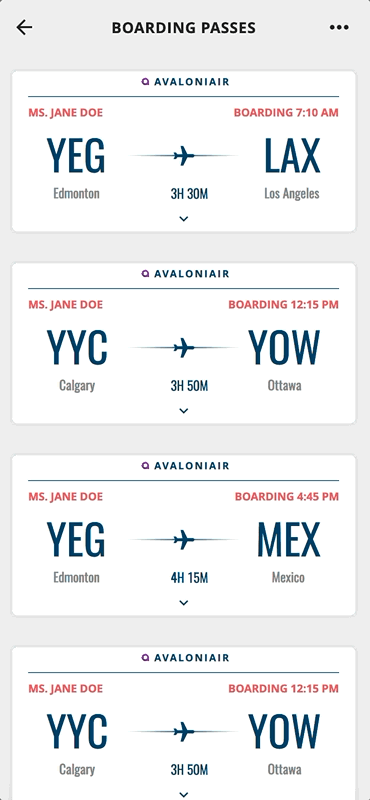

# Boarding Pass Cards

An Avalonia port of [ticket_fold](https://github.com/gskinnerTeam/flutter_vignettes/tree/master/vignettes/ticket_fold).

<p align="center"></p>

Tap a boarding pass and it concertinas open, one panel after another, each hinging on its own top edge and carrying the panels below it.

## Running

```
dotnet run --project TicketFold.csproj
```
